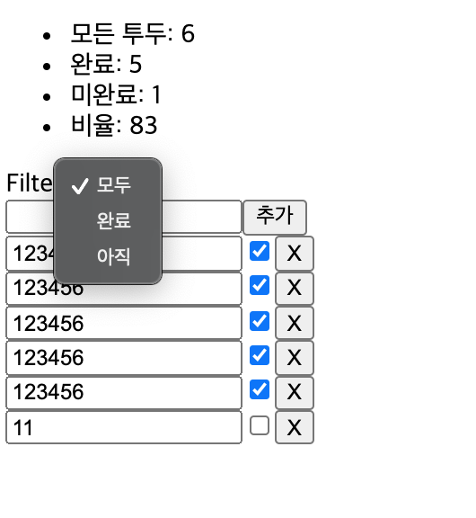

> https://recoiljs.org/docs/basic-tutorial/intro

## Intro

- Add todo items
- Edit todo items
- Delete todo items
- Filter todo items
- Display useful stats

```
src
├── components
│ ├── TodoList.js
│ ├── TodoItemCreator.js
│ ├── TodoItem.js
│ ├── TodoListFilters.js
│ └── TodoListStats.js
├── states
│ ├── todoListState.js
│ └── todoListFilterState.js
│ ├── filteredTodoListState.js
│ └── todoListStatsState.js
├── App.js
└── index.js
```


